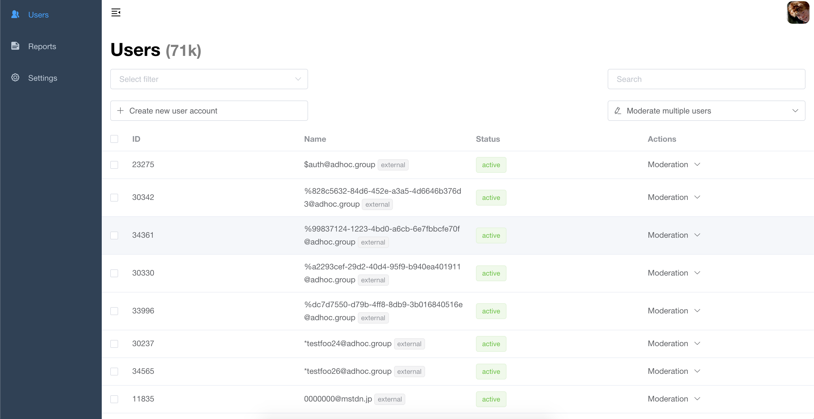

# Pleroma AdminFE

## About

Admin UI for pleroma instance owners.

### Branches

There are two main branches here:

- `develop`: ongoing work and all merge requests go here, *unstable*
- `master`: after `develop` is stabilized it is merged to `master`, `master` is *stable*, allegedly

### Features

1. User administration: grant roles to users (admin/moderator), deactivate/delete as well as force their statuses to have NSFW tag, strip media and many more
1. Invites management: generate invite tokens & send invites via email
1. Moderation log: track moderator/admin actions
1. Settings: configure your pleroma instance via friendly (hopefully) UI
1. Emoji packs: configure your emoji packs

You can have any combination of these features (i.e. you can disable anything, but user administration, see "Disabling features" section below).

## Usage

### Development

To run AdminFE locally execute `yarn dev`

### Build

To compile everything for production run `yarn build:prod`.

#### Disabling features

You can disable certain AdminFE features, like reports or settings by modifying `config/prod.env.js` env variable `DISABLED_FEATURES`, e.g. if you want to compile AdminFE without "Settings" you'll need to set it to: `DISABLED_FEATURES: '["settings"]'`.

Features, that can be disabled:

- reports: `DISABLED_FEATURES: '["reports"]'`
- invites: `DISABLED_FEATURES: '["invites"]'`
- moderation log: `DISABLED_FEATURES: '["moderationLog"]'`
- settings: `DISABLED_FEATURES: '["settings"]'`
- emoji packs: `DISABLED_FEATURES: '["emojiPacks"]'`

Of course, you can disable multiple features just by adding to the array, e.g. `DISABLED_FEATURES: '["emojiPacks", "settings"]'` will have both emoji packs and settings disabled.

Users administration cannot be disabled.

## Changelog

Detailed changes for each release are documented in the [CHANGELOG](./CHANGELOG.md).

## Browsers support

Modern browsers and Internet Explorer 10+.

|  IE / Edge |  Firefox |  Chrome |  Safari |
| --------- | --------- | --------- | --------- |
| IE10, IE11, Edge| last 2 versions| last 2 versions| last 2 versions

## License

Pleroma AdminFE is build on top of the [Vue Element Admin](https://github.com/PanJiaChen/vue-element-admin), which is licensed under [MIT](https://github.com/PanJiaChen/vue-element-admin/blob/master/LICENSE) license.

AdminFE's own code is licensed under [AGPL](./AGPL-3)
